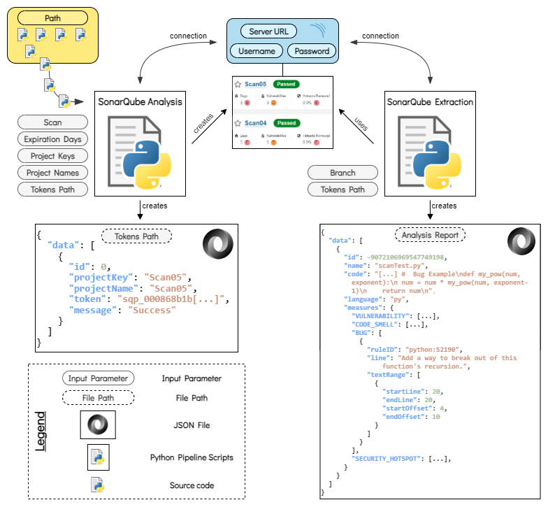
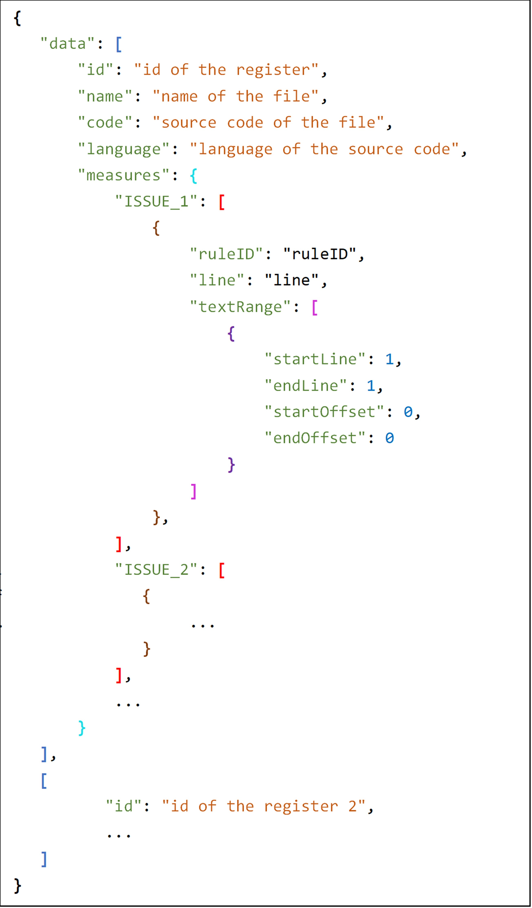

# Automatic dataset generation for automated program repair of bugs and vulnerabilities through SonarQube.
This repository stores the code used for implementing the program exposed in 
Software-X paper.

# Overall Architecture

The following figure shows the architecture of this program.

<p align="center">
    
</p>

# Instalation Instructions
In this section, two different ways to install our software are given.

    1. Clone this repository.
    2. Download files using GitHub Web interface.

## Clone repository
For this first option, (1) bash and (2) cmd commands are written below.

### Bash commands
```bash
# Move to the directory in which you want to clone the repository
cd {target_directory}
# Clone the repository
git clone #TODO
```

### Cmd commands
```cmd
cd {target_directory}
git clone #TODO
```

## Running the program

### Previous Configuration of SonarQubeAnalysis.py

To run the SonarQubeAnalysis script the next steps need to be followed:

1. Open the 'SonarQubeAnalysis.py' file and follow the instructions.
    a. Indicate in the variable "path" the folder where the source code to analyse is stored (line 24).
    b. Specify, in the variable "sonarscanner_path", the path where sonar-scanner is located (line 21).
    c. Update the variable "URL" by indicating an url that identifies a working and reachable SonarQube server instance (line 7).
    d. Specify valid user credentials (username (line 8) and password (line 9) variables) to access the specified SonarQube server. 
2. Additionally, there are some optional parameters which can be modified.

Parameter name      | Variable Type or domain   | Line  | Description                                       
------------------- | ------------------------- | ----- | --------------------------------------------------
Scan                | {true, false}             | 17    | Whether to scan a project or not. Useful in a complete pipeline to skip the analysis phase, or to discard some analysis steps.
Expiration Days     | Natural                   | 25    | Time expressed in days in which the token will be functional.
Project Keys        | List[String]              | 32    | Project identifiers. To create n projects, a list of n Strings must be created (n ≥ 1). This list must have the same length as projectNames.
Project Names       | List[String]              | 33    | Project names. To name n projects, a list of n Strings must be created (n ≥ 1). It is recommended that the same names used in Project Keys are used in this parameter too. This list must have the same length as projectKeys.
Tokens Path         | String                    | 37    | Complete path where the intermediate JSON file will be created. 

3. The command inside the script is an example used during the creation of the program, which is prepared to analyze source code in Python. Here, it should be written the command specified by SonarQube for each programming language.

### Run of the SonarQubeAnalysis.py

Once the configuration has been done, SonarQubeAnalysis.py file can be executed. For this purpose, it can be executed in any IDE with Python compatibility or with the following command:
```bash
cd {target_directory}
python SonarQubeAnalysis.py
```

### Output of SonarQubeAnalysis.py

After executing the script:

* One or more SonarQube repositories with every file analysis are created.
* A JSON file containing the main information required to identify each new project is created in the specified "tokensPath". The following table gives a description for each field of the JSON file.

Parameter Name  | Description 
--------------  | -----------
ID              | Register identifier within the JSON (0 ≤ ID ≤ n). 
Project Key     | SonarQube repository identifier. This parameter takes its corresponding value from ProjectKeys.
Project Name    | SonarQube repository name. This parameter takes its corresponding value from ProjectNames.
Token           | Generated token required to access a repository. After being created, it is hidden, so storing it is needed for the extraction phase. 
Message         | States if the repository has been created successfully (message = “Success”) or not  (message = “Failure”)

Regarding the JSON file, its information will be needed for the extraction phase.

### Previous Configuration of SonarQubeExtraction.py

Finally, to run the SonarQube the following configuration needs to be done.

1. Indicate, in the "tokensPath" variable (line 20), the same folder specified for the "tokensPath" variable in SonarQubeAnalysis script. If you are running only this script, you should specify where the JSON file generated by the previous phase is stored.
2. Indicate, as it has been done for the previous script, the server url (line 7) and user credentials (lines 8 and 9).
2. Additionally, there is a parameter which may be modified if the default process is not followed.
    * <u>branch variable:</u> specify the branch of the SonarQube repository to analyze. By default, it is the "main" branch (line 17). If the previous steps have been followed, no further changes are needed, as SonarQubeAnalysis.py creates the repositories in the branch "main". Otherwise, the user must specify the branch for data extraction.

### Run of the SonarQubeExtraction.py

Once the configuration has been done, SonarQubeExtraction.py file can be executed. For this purpose, it can be executed in any IDE with Python compatibility or with the following command:
```bash
cd {target_directory}
python SonarQubeExtraction.py
```

### Output of SonarQubeExtraction.py

The execution of the SonarQubeExtraction script provides a JSON file with the following format.

<p align="center">
    
</p>

